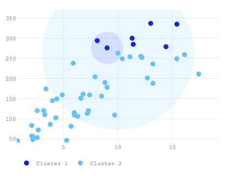
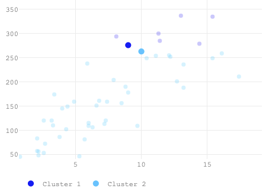
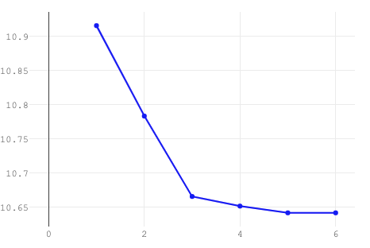
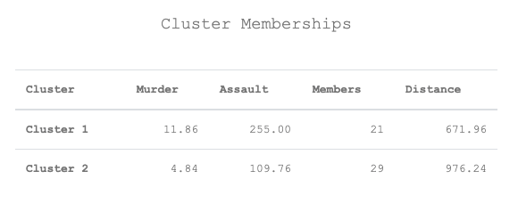

# KMeans Applet

A simple PHP/Javascript applet for demonstrating the mathematics behind the K-Means Clustering algorithm.

## Algorithm Notes

This applet demonstrates a basic implementation of K-means clustering based on Lloyd's algorithm [1]. The algorithm finds a set of means or centroids mk, k = 1,2,...,<em>K</em>  such that each data point xi, i = 1,2,...,<em>N</em> can be partitioned based on their assignment to one of these <em>K</em> centroids. The centroids are continuously updated such that the distances between each point and their assigned centroids are minimized.

We begin by randomly assigning <em>K</em> points from the data to serve as our initial centroids. More efficient initializations leading to faster convergences can be found [2,3], but for a simple two-dimensional case we can make do with this basic procedure. Once the <em>K</em> centroids have been initialized, we assign each of the xi to a particular centroid, this assignment indicated by Ci, based on which centroid is closest to xi by the Euclidean distance.

After assignment, we obtain an update of the centroid by averaging across all currently assigned data points:

    

 

Then all points are again reassigned to their new clusters based on the updated positions of the centroids. At each step we measure the total (Euclidean) distance between each point and their assigned centroid. To control the range of distances, we obtain their logarithms.

    

 

Finally, convergence is achieved once the minimum distance per cluster:

    

has changed by no more than a set tolerance level. This applet uses a very small tolerance of 1e-100, but we also set a maximum iteration count of 20 in case the algorithm struggles to find a local minimum (which Lloyd's Algorithm has been known to experience in many cases). On the US Arrests data set (see citations), we reach convergence within around 2 to 5 iterations only.

## Features

This applet was written in Javascript by <a href = "https://github.com/dominicdayta" target="_blank">Dominic Dayta</a>. Plots were produced using the <a href= "https://plotly.com/javascript/" target = "_blank">Plotly Javascript library</a>.

The user may interact with the applet by clicking on the <strong>Iterate</strong> button, which performs the updating steps of Lloyd's algorithm. Three plots are provided to track the progress of the algorithm towards convergence.

The first plot visualizes the data points across its dimensions (only two are allowed for this applet) and colored based on their cluster assignments. Each cluster's nearby neighborhood is displayed as a circular backdrop whose radius is proportional to its number of members. As the user moves through iterations, these neighborhoods shift in location across the space and so do the data points change cluster assignments. Because of the way we initialize the clusters, it is possible that in the beginning, clusters may overlap or even be completely inscribed within another cluster. This is immediately corrected as soon the algorithm begins updating.

The second plot displays only the centroids as they are updated across iterations. The data points are provided in the backdrop to provide an idea of how the centroids are moving, and the members that are being included and excluded at each iteration.

The third and last plot tracks the improvements in within-group distances as the algorithm updates. Because the objective of the algorithm is to minimize this value to convergence, the algorithm stops and declares convergence when this line flattens out.

A table is also provided listing at each iteration the clusters and their centroid coordinates, along with the number of members, and the average distance of each member to the centroid.

## Citations

<ol>
<li><strong>Lloyd, Stuart P. (1982).</strong> <a href = "https://cs.nyu.edu/~roweis/csc2515-2006/readings/lloyd57.pdf" target="_blank">"Least squares quantization in PCM."</a> <em>IEEE Transactions on Information Theory.</em> 28 (2): 129–137.</li>
<li><strong>Hamerly, Greg; Elkan, Charles (2002).</strong> <a href = "https://people.csail.mit.edu/tieu/notebook/kmeans/15_p600-hamerly.pdf" target="_blank"> "Alternatives to the k-means algorithm that find better clusterings."</a> <em>Proceedings of the eleventh international conference on Information and knowledge management (CIKM).</em></li>
<li><strong>Celebi, M. E.; Kingravi, H. A.; Vela, P. A. (2013).</strong> <a href = "https://www.sciencedirect.com/science/article/abs/pii/S0957417412008767" target="_blank">"A comparative study of efficient initialization methods for the k-means clustering algorithm".</a> <em>Expert Systems with Applications.</em> 40 (1): 200–210.</li>
<li><strong>McNeil, D. R. (1977)</strong> <em>Interactive Data Analysis</em>. New York: Wiley. [Contains US Arrests data adopted from the R datasets.]</li>
    </ol>